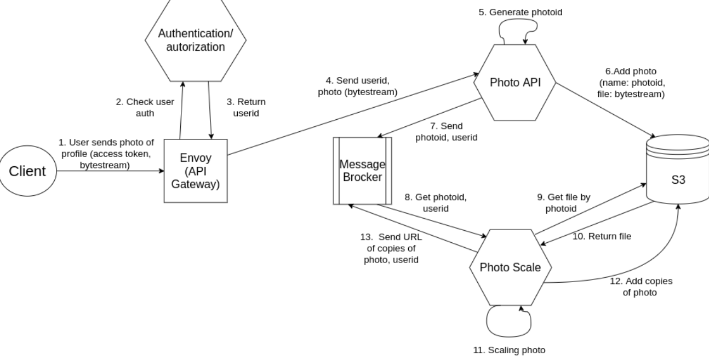

# About

This is microservice of our *IASA-KA-75-KA-76-Pharos-Production-Distributed-Systems* project called **SagasLife**. This part is responsible for scaling photos to different resolutions(by width).

- [About](#about)
- [Data flows](#data-flows)
- [Algorithm](#algorithm)
- [Examples](#examples)
    - [Scaling new photo](#scaling-new-photo)
    - [Deletion of scales](#deletion-of-scales)
- [Customization](#customization)
- [Running](#running)
- [Running kafka](#running-kafka)
- [Running tests](#running-tests)
  - [Unit tests](#unit-tests)
  - [Integration tests](#integration-tests)
- [Running in docker](#running-in-docker)

# Data flows

The main operation is scaling original photo:

# Algorithm

Two main operations is put and delete photo. Both of them accept image name. Requests to this microservice are sent via Kafka topics. All of the topic names can be configured via `conf/config.json`. All errors are being reported to `Sagas` microservice via `sagasTopic` option in config file. 

There are two main topics `userpicsTopic` and `photosTopic` that are responsible for streaming two types of messages: `put:` and `del:` photo. The type of topic is needed to determine the type of AWS S3 bucket, that stores original photo to rescale and in which future scales will be stored.

# Examples

### Scaling new photo

Message in `userpicsTopic` : 

**put:pretty_woman.jpg**

Actions:

1. `put:` means this is scale request, `userpicsTopic` means, that this photo is stored in `userpicsBucket`.
2. Get original `pretty_woman.jpg` photo from AWS
3. Scale it to different sizes defined in config file.
4. Sent it to S3 adding suffixes defined in config. For example three new files will be created: `pretty_woman.jpg.sm`, `pretty_woman.jpg.md`, `pretty_woman.jpg.lg`, that means small, medium and large sizes respectively.
5. Report operation status to `Sagas`

### Deletion of scales

Message in `photosTopic` :  

**del:pretty_woman.jpg**

Actions:

1. `del:` means this is scale request, `photosTopic` means, that this photo is stored in `photosBucket`.
2. Sent removal request to AWS s3 adding suffixes defined in config. For example three files will be removed : `pretty_woman.jpg.sm`, `pretty_woman.jpg.md`, `pretty_woman.jpg.lg` that means small, medium and large sizes respectively.
3. Report operation status to `Sagas`

# Customization

All this settings defined in `scales/src/main/resources/conf/config.json` - Single Source Of Truth. Customize it to suit your needs, even without reloading the project.

1. `sizes`: add new sizes to scale into
2. `aws`
   - `photosBucket`: name of ordinary photos S3 bucket
   - `userpicsBucket`: name of userpics S3 bucket
   - `region`: region of bucket, like it is defined in aws links(e. g. `us-east-2`)
3. `extension`: image extension(e. g. `jpg`)
4. `kafka`
   - `host`
   - `port`
   - `photosTopic`: name of ordinary photos topic
   - `userpicsTopic`: name of userpics topic
   - `sagasTopic`: name of `Sagas` topic
   - `deleteRequest`: prefix of delete request(like `del:`) 
   - `scaleRequest`: prefix of scale request(like `put:`)
   
# Running

Use java 12. Add new configuration with such settings:
1. Main class: `scales.Launcher`
2. Program arguments: `run scales.verticles.MainVerticle -cluster`
3. Classpath of module: `photo-scale-microservice.scales.main`

Then provide such environment variables: `AWS_S3_ACCESS_KEY` and `AWS_S3_SECRET_KEY`, to use your AWS S3. All of these you could get as described [here](https://support.infinitewp.com/support/solutions/articles/212258-where-are-my-amazon-s3-credentials-).

For more info on configuring run, read [this](https://github.com/IASA-HUB/vertx-starter-pack/wiki/How-to-make-things-work) one.

# Running kafka

To run project you need to start kafka with configuration from `scales/src/main/resources/conf/config.json` file. Go to `misc/kafk..` and there are 5 `.sh` files:

1. `start1ZooKeeper.sh`
2. `start2Kafka.sh`
3. `createTopic.sh`
4. `listenTopic.sh`
5. `send2Topic.sh`

Here is my normal usage of this commands(assuming topics are previously created):
1. `./start1ZooKeeper.sh`
2. `./start2Kafka.sh`
3. `./send2Topic.sh local userpicsTopic`
4. `./send2Topic.sh local photosTopic`
5. `./listenTopic.sh local sagasTopic`

P. S. You'll need a whole lot of terminals(or a virtual terminals, like [terminator is](https://terminator-gtk3.readthedocs.io/en/latest/#). Highly recommend!)

# Running tests

There are two types of tests for this project:
1. Unit tests - testing autonomous part of the code
2. Integration tests - testing project as a whole

From now on we are inside directory `scales/src/test/java`

## Unit tests

There are one unit test currently: `ResizeTest`. You should add JUnit configuration pointing to `unit/ResizeTest`.
It is responsible for testing `ImageResize` class.

## Integration tests

To run this ones you need to start kafka and run main configuration(two items above). 
Then add two configurations pointing to `integration/DeleteTest` and `integration/ScaleTest`.

You could easily add your own tests of this type: just inherit from abstract class `integration/ScaleGeneralTest` 
and define custom method: `actualTests`, fulfill it with 4 types of method calls: 

1. `delPhoto` - put delete request to photosTopic;
2. `delUserpic` - put delete request to userpicsTopic;
3. `putPhoto` - put scale request to photosTopic;
4. `putUserpic` - put scale request to userpicsTopic;

That's it, inherited code will easily do the job for you!

**But beware of mixing `del` and `put` requests!**
Because of asynchronous nature of vertx it might not be completed sequentially, as you'd want it to be.
Even though the tests will pass. The reason it works because in real world there are no chance that two
types of requests are being fired on one photo simultaneously.

# Running in docker

Just run `docker-compose up` and you are done, well it is not THAT easy, but it is easy indeed.
Firstly you need to read `.env_exmpl` file and do what it tolds you.
Then you can steadily run `docker-compose up`, it will perform this ones for you:
1. Setting up zookeeper
2. Setting up kafka
3. Setting up vertx(running program)

Now you need to connect to internal docker kafka, so that you can send some info inside. 
Use `misc/kafka.../send2Topic.sh` and `misc/kafka.../listenTopic.sh` in such a way(to send to internal kafka):
1. `./send2Topic.sh userpicsTopic`
2. `./send2Topic.sh photosTopic`
3. `./listenTopic.sh sagasTopic`

Go on, just write `put:some_photo.jpg` or `del:other_photo.jpg`. But this photos should at least be on your `S3`.
